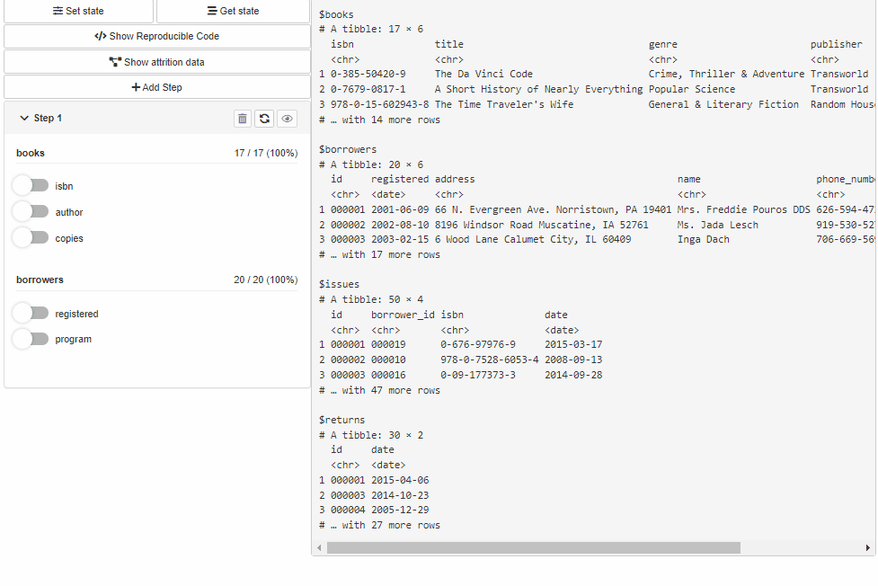
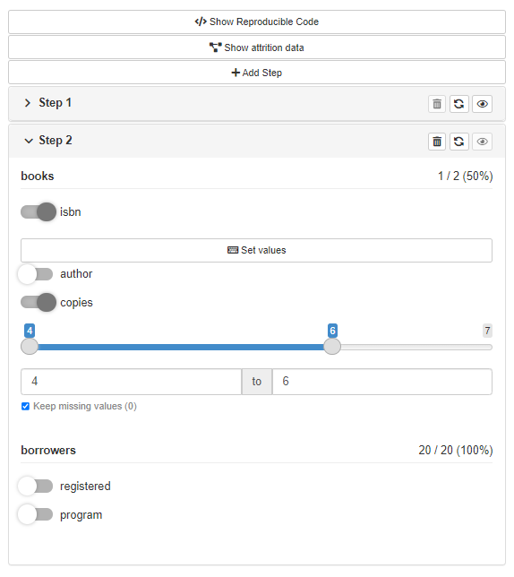

# shinyCohortBuilder 

Move your [cohortBuilder](https://r-world-devs.github.io/cohortBuilder/)
workflow to Shiny.



[](https://r-world-devs.github.io/shinyCohortBuilder/)
[](https://lifecycle.r-lib.org/articles/stages.html#experimental)

## Installation

``` r
# CRAN version
install.packages("shinyCohortBuilder")

# Latest development version
remotes::install_github("https://github.com/r-world-devs/shinyCohortBuilder")
```

## Overview

With `shinyCohortBuilder` you can use `cohortBuilder` features within
your shiny application.

Configure Source and Cohort filters with `cohortBuilder` (set
`value/range` to `NA` to select all the options / the whole range, and
`active  = FALSE` to collapse filter in GUI):

``` r
librarian_source <- set_source(as.tblist(librarian))
librarian_cohort <- cohort(
  librarian_source,
  filter(
    "discrete", id = "author", dataset = "books", 
    variable = "author", value = "Dan Brown", 
    active = FALSE
  ),
  filter(
    "range", id = "copies", dataset = "books", 
    variable = "copies", range = c(5, 10), 
    active = FALSE
  ),
  filter(
    "date_range", id = "registered", dataset = "borrowers", 
    variable = "registered", range = c(as.Date("2010-01-01"), Inf),
    active = FALSE
  )
)
```

And apply in your application with `cb_ui` and `cb_server`:

``` r
library(shiny)

ui <- fluidPage(
  sidebarLayout(
    sidebarPanel(
      cb_ui("librarian")
    ),
    mainPanel()
  )
)

server <- function(input, output, session) {
  cb_server("librarian", librarian_cohort)
}

shinyApp(ui, server)
```

You may listen to cohort data changes with
`input[[<cohort-id>-data-updated]]`:

``` r
library(shiny)

ui <- fluidPage(
  sidebarLayout(
    sidebarPanel(
      cb_ui("librarian")
    ),
    mainPanel(
      verbatimTextOutput("cohort_data")
    )
  )
)

server <- function(input, output, session) {
  cb_server("librarian", librarian_cohort)
  
  output$cohort_data <- renderPrint({
    input[["librarian-data-updated"]]
    get_data(librarian_cohort)
  })
  
}

shinyApp(ui, server)
```

Or run filtering panel locally what just makes your work with
`cohortBuilder` easier:

``` r
gui(librarian_cohort)
```



If you’re interested in more features of `shinyCohortBuilder` please
visit the package
[website](https://r-world-devs.github.io/shinyCohortBuilder/).

## Acknowledgement

Special thanks to:

- [Kamil Wais](mailto:kamil.wais@gmail.com) for highlighting the need
  for the package and its relevance to real-world applications.
- [Adam Foryś](mailto:adam.forys@gmail.com) for technical support,
  numerous suggestions for the current and future implementation of the
  package.
- [Paweł Kawski](mailto:pawel.kawski@gmail.com) for indication of
  initial assumptions about the package based on real-world medical
  data.

## Getting help

In a case you found any bugs, have feature request or general question
please file an issue at the package
[Github](https://github.com/r-world-devs/shinyCohortBuilder/issues). You
may also contact the package author directly via email at
<krystian8207@gmail.com>.
