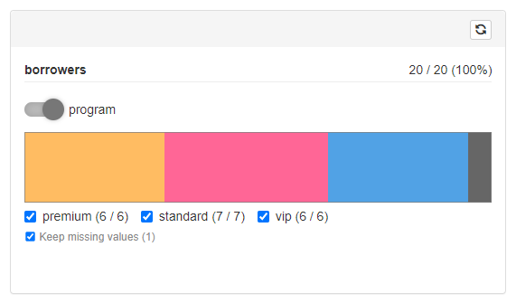

```{r, include = FALSE}
knitr::opts_chunk$set(
  collapse = TRUE,
  comment = "#>"
)
library(shinyCohortBuilder)
```

In this document you'll learn how to write custom filter controller for the selected filter.

## GUI Filter Layer as a S3 Method

When working with `cohortBuilder` in order to configure filter you need to precise its type:

```{r}
library(cohortBuilder)
iris_source <- set_source(tblist(iris = iris))
species_filter <- filter(
  type = "discrete", 
  id = "species",
  dataset = "iris",
  variable = "Species",
  value = "setosa"
)
```

Such filter evaluated on Source (the operation happens within the Cohort) becomes an object of class equal to the filter type:

```{r}
evaled_filter <- species_filter(iris_source)
class(evaled_filter)
```

For the further needs let's highlight what methods and parameters are originally stored withing the evaluated filter object:

```{r}
str(evaled_filter, give.attr = FALSE)
```

`shinyCohortBuilder` extends the filter attaching GUI-specific methods to it using `.gui_filter` S3 method.
The methods are available at `filter$gui` object.

So, in order to implement custom filter controller we need to create `.gui_filter.<filter-type>` function.

The method takes filter (evaluated on source) as its argument and should return a list of the below objects:

- `input` - UI structure defining filter input controllers.
- `feedback` - List defining feedback plot output.
- `server` - Optional server-side expression attached to filter panel (e.g. filter specific observers).
- `update` - An expression used for updating filter panel based on its configuration.
- `post_stats` - TRUE if post statistics are displayed in filter controller (e.g. for discrete filter).
     If FALSE, some operations are skipped which results with better performance.
- `multi_input` - TRUE if multiple input controllers are used for providing
     filter value (e.g. range input where both numericInput and sliderInput are used).
     If FALSE, some operations are skipped which results with better performance.

Below we describe requirements and exact role of each object.
We will base the description using "discrete" filter example.

### input

`input` is the function returning the UI structure of filter input controllers (the content visible when filter is enrolled in filtering panel).

It takes two argument:

- `input_id` - Concatenation of step_id and filter_id (plus namespace). Can be used as an input controller id (but doesn't have to).
- `cohort` - The Cohort object.

Example of implementation (simplified version used for "discrete" filter):

```{r, eval = FALSE}
.gui_filter.discrete <- function(filter, ...) {
  list(
    input = function(input_id, cohort) {
      shiny::tagList(
        .cb_input(
          do.call(
            shiny::checkboxGroupInput,
            discrete_input_params(filter, input_id, cohort, ...)
          ),
          filter$input_param
        ),
        .cb_input(
          keep_na_input(input_id, filter, cohort),
          "keep_na"
        )
      )
    },
    # other objects
  )
}
```

What we can realize, based on the construction, is that inside of the `input` function we can use not only its arguments but also `filter` object from the parent environment. This way we can access all the methods and metadata originally attached to the filter (i.e. its parameters via `filter$get_params()`).

As we can see the function returns a list (`tagList`) of two input controllers:

- `checkboxGroupInput` - responsible for setting up filter value,
- `keep_na_input` - helper function returning a checkbox responsible for inclusion/exclusion of NA values (value of `keep_na` filter argument).

The more important both input controllers are wrapped into `.cb_input` function.

Let's first describe to meaning of `.cb_input`.

The function is responsible for registering any changes in input controller and updating the corresponding filter argument (with the value of controller).
You may spot, we pass `filter$input_param` and `"keep_na"` as the second argument of `.cb_input` for `checkboxGroupInput` and `keep_na_input` respectively.
The second argument informs `shinyCohortBuilder` via `.cb_input` which argument exactly should be updated in filter while changing the controller input.

This is the reason why do we keep the name of filter parameter responsible for data filtering (`input_param`) inside of the `cohortBuilder`'s filter (the name may differ for various filter types i.e. "value" for discrete filter, "range" for range filter).

The second effect of `.cb_input` is that input controllers wrapped into the function are sensitive only browser-site actions.
That means filter arguments are updated only when user changes its value in the filtering panel - updating the input from server with `update*` function will affect only the controller visually.

Such effect is taken to assure no unneeded reactivity triggers are run. 
To make it more clear let's consider a situation where filter panel consists of one discrete filter and we display post statistics nearby each checkbox option.



When changing selection in the filter we:

1. Update the filter value in Cohort.
2. Trigger data calculations.
3. Update post statistics for the filter in Cohort.
4. Update input controller choices having new statistics included.

The last step is taken by using `update*` function, what triggers `shiny:inputchanged` JS event that `shinyCohortBuilder` uses for updating filter arguments.
Such behavior results with another round of the above steps what could end up with having reactivity loop.
Using `.cb_input` assures `shiny:inputchanged` JS event doesn't trigger another filter parameters update when called using `update*` method.

Let's move now to describe further assumptions while writing custom `input` method for `.gui_filter`.

Looking at the below code sample:

```{r, eval = FALSE}
do.call(
  shiny::checkboxGroupInput,
  discrete_input_params(filter, input_id, cohort, ...)
)
```

We can see internal function `discrete_input_params` is used to create a list of parameters sent to `shiny::checkboxGroupInput`.

While writing the function you should take into consideration the below assumptions:

1. When no data exists in the previous step the parameters should return an empty input controller.

For discrete filter (`checkboxGroupInput`) we achieve this with:

```{r, eval = FALSE}
if (!cohort$get_cache(step_id, filter_id, state = "pre")$n_data) {
  return(
    list(inputId = input_id, choices = character(0), selected = character(0), label = NULL)
  )
}
```

where:

```{r, eval = FALSE}
step_id <- filter$step_id
filter_id <- filter$id
```

It's recommended to use cached statistics saved in the Cohort object to minimize the amount of operations.
All the cached information for the specific filter are computed with `get_stats` filter method.

In case of discrete filter (for "tblist" source data type) it computes:

- `choices` - named list storing counts for each variable level,
- `n_data` - integer storing number of non-missing values,
- `n_missing` - integer storing number of `NA`s

2. When filter value is NA, the controller should select all the available options (or range).

You may get the current filter parameters with:

```{r, eval = FALSE}
filter_params <- filter$get_params()
```

and value with:

```{r, eval = FALSE}
filter_params[[filter$input_param]]
```

Extracting all the possible options can be done with:

```{r, eval = FALSE}
names(
  cohort$get_cache(step_id, filter_id, state = "pre")$choices  
)
```

3. Filter controller choices should be based on the previous step.

This can be easily extracted using previous step cache:

```{r, eval = FALSE}
names(
  cohort$get_cache(step_id, filter_id, state = "pre")$choices  
)
```

4. When [value mapping](shinyCohortBuilder.html#filter-vs-filter-controller) is defined for the filter it should be used to convert choices labels accordingly.

You can check is value mapping is defined with:

```{r, eval = FALSE}
!is.null(filter_params$value_mapping)
```

and access the value mapping function with:

```{r, eval = FALSE}
cohort$get_source()$attributes$value_mappings[[filter_params$value_mapping]]
```

5. When the filters displays pre/post statistics (i.e. discrete filter does) you should assure the ones are included in according filter labels.

For this case you may use a helper `.pre_post_stats` (or `.pre_post_stats_text`) function:

```{r, eval = FALSE}
.pre_post_stats_text(
  name = <choices labels names vector>,
  current = <current step statistics vector>,
  previous = <previous step statistics vector>,
  stats = <"pre, post", both or NULL> # it's recommended to use `stats = cohort$attributes$stats` to inherit the option from Cohort configuration
)
```

which returns labels with the selected statistics and brackets added.

The function returns labels in an HTML structure attaching proper classes to the current step labels.
Such (HTML) class is used to grey out the label when working with `Run Button` feature.

```{r}
.pre_post_stats_text(
  name = c("A", "B"),
  current = 1:2,
  previous = 3:4,
  stats = c("pre", "post")
)
```

6. The filter controller should not have any label attached.

For `checkboxGroupInput` (and most of shiny controllers) this can be achieved with `label = NULL`.

### feedback

`input` is the function returning the UI structure of filter input controllers (the content visible when filter is enrolled in filtering panel).

It takes two argument:

- `input_id` - Concatenation of step_id and filter_id (plus namespace). Can be used as an input controller id (but doesn't have to).
- `cohort` - The Cohort object.
- `empty` - FALSE by default. When NULL (feedback plot are turned off) feedback should return no value. 
When TRUE (no valid data exists in the previous filtering step, i.e. number of rows is zero) an empty plot should be returned (preferable with very small height).

The function should return list of three objects:

- `plot_id` - id of feedback plot output (preferably modification of `input_id` including namespace),
- `output_fun` - plot output UI placeholder function,
- `render_fun` - plot output rendering logic (excluding output assignment).

Example of implementation (simplified version used for "discrete" filter):

```{r, eval = FALSE}
.gui_filter.discrete <- function(filter, ...) {
  list(
    feedback = function(input_id, cohort, empty = FALSE) {
      list(
        plot_id = shiny::NS(input_id, "feedback_plot") ,
        output_fun = ggiraph::girafeOutput,
        render_fun = if (!is.null(empty)) {
          ggiraph::renderGirafe({
            if(empty) { # when no data in parent step
              return(
                ggiraph::girafe(
                  ggobj      = ggplot2::ggplot(),
                  width_svg  = 10,
                  height_svg = 0.1
                )
              )
            }
            step_id <- filter$step_id
            filter_id <- filter$id

            filter_cache <- cohort$get_cache(step_id, filter_id, state = "pre")
            filter_value <- extract_selected_value(filter$get_params()$value, filter_cache$choices, FALSE)
            plot_data <- filter_cache$choices[filter_value]
            n_missing <- filter_cache$n_missing
            if (identical(filter$get_params()$keep_na, FALSE)) {
              n_missing <- 0
            }

            plot_feedback_bar(plot_data, n_missing)
          })
        }
      )
    },
    # other methods
  )
}
```

Details:

- `render_fun` should be wrapped within `if (!is.null(empty)) {}` if claim.
- Inside the rendering function body, return an empty plot when `empty = TRUE`.
- It's recommended to generate plot based on cached Cohort statistics.
The filter cache can be accessed with: `cohort$get_cache(step_id, filter_id, state = "pre")`, where:

```{r, eval = FALSE}
step_id <- filter$step_id
filter_id <- filter$id
```

### server

This is an optional method providing extra logic to filter controller in the application server.
The function is called only once when filter controller is rendered.

In case of discrete filter, the function is used to extend logic for feedback plot.
Whenever a field related to specific value is clicked on the plot it result with selecting the value in input controller.

So we define there an observer, that listens to plot click action and triggers accordingly "update_filter" action:

```{r, eval = FALSE}
.gui_filter.discrete <- function(filter, ...) {
  list(
    server = function(input_id, input, output, session, cohort) {
      shiny::observeEvent(input[[shiny::NS(input_id, "feedback_plot_selected")]], {
        value <- input[[shiny::NS(input_id, "feedback_plot_selected")]]

        if (!is.na(value)) {
          .trigger_action(session, "update_filter", params = list(
            step_id = filter$step_id, filter_id = filter$id,
            input_name = filter$input_param, input_value = value,
            run_flow = FALSE
          ))
        }
      }, ignoreInit = TRUE) %>% .save_observer(input_id, session)
    },
    # other methods
  )
}
```

You may spot here a usage of `.save_observer`, to which the observer is passed.
The method is used to save the observer in application memory, so that the observer is destroyed whenever the filter is removed.

The action is taken to prevent observers [accumulation](https://appsilon.com/how-to-safely-remove-a-dynamic-shiny-module/).

### update

`update` is the function defining how filter input controllers should be updated based on the previous and current step data.

The method is called in the below scenarios:

- when previous filtering step was modified,
- when filter displays post statistics (i.e. discrete filer) and the current data changed (for example by making any changes in the current step),
- when filter GUI panel is using multiple input controllers and one of them has changed,
- when "Clear Step" button is pressed,
- when `update_filter` action was triggered directly (advanced case)

`update` function is strongly related to the `input` one.
The parameters passed to related `update*` methods should follow the same assumptions as stated for `input`.
More to that there is one extra rule regarding "Clear Step" scenario which we describe below.

The update function should have the below parameters defined:

- `session` - Shiny session object passed to `update*` methods.
- `input_id` - The same ID as passed to `input`.
- `cohort` - Cohort object.
- `reset` - If TRUE, the `update` method is called due to click of "Clear Step" button.

Below we present the sample of `update` method used for discrete filter: 

```{r, eval = FALSE}
.gui_filter.discrete <- function(filter, ...) {
  list(
    update = function(session, input_id, cohort, reset = FALSE, ...) {
      update_params <- discrete_input_params(filter, input_id, cohort, reset = reset, update = TRUE, ...)
      do.call(
        shiny::updateCheckboxGroupInput,
        append(
          list(session = session),
          update_params
        )
      )
      .update_keep_na_input(session, input_id, filter, cohort)
    },
    # other methods
  )
}
```

As you can see, we reuse `discrete_input_params` function for generating the parameters, with two extra arguments passed to it:

- `reset` - the information that states "Clear Step" was clicked,
- `update` - an indicator that states we generate parameters for `update` method.

Now let's highlight how `reset` and `update` argument affect the returned parameters:

1. When `reset = TRUE` controller should select all the available options (or range). 

Again, all the possible options can be extracted with:

```{r, eval = FALSE}
names(
  cohort$get_cache(step_id, filter_id, state = "pre")$choices  
)
```

2. When `update = TRUE` the filter controller label should be cleared.

There is a small difference comparing to case when label is defined for initializing the controller.
In the case `label = NULL` but for `update` the valid value id `label = character(0)`.

So we only need to add:

```{r, eval = FALSE}
label = if (update) character(0) else NULL
```

Looking at the code sample for `update` above we may realize, the usage of `.update_keep_na_input`.
You can use the function whenever you use `.keep_na_input` in `input` function.

### post_stats

Static logical value informing whether the filter can display post statistics.
When TRUE, the filter will be updated (using attached `update` method) whenever any other filter is changed (to assure up to date value of post statistic).

### multi_input

Logical value informing whether the filter GUI panel uses multiple input controllers to specify the filter value (range filter case when both slider and numeric input are used).
When TRUE, `shinyCohortBuilder` will be informed to update input controller whenever the other one changes.
