```{r, include = FALSE}
knitr::opts_chunk$set(
  collapse = TRUE,
  comment = "#>"
)
library(magrittr)
library(cohortBuilder)
library(shinyCohortBuilder)
set.seed(123)
old_opts <- options()
options(tibble.width = Inf)
iris <- tibble::as.tibble(iris)
options("tibble.print_max" = 5)
options("tibble.print_min" = 5)
```

This document presents to you the functionality offered by `shinyCohortBuilder` package.
You'll learn here how to apply `cohortBuilder` into your Shiny application and 
how filters configuration affects the resulting GUI. 
Later on, we'll present what `cohortBuilder` features can be used in Shiny and what steps can you make to automate cohort configuration.

## shinyCohortBuilder vs. cohortBuilder

When creating `cohortBuilder` our main goal was to easily allow using its features in Shiny.

With the approach taken in `cohortBuilder`: 

- keeping Cohort objects as an R6 class,
- introduced hooks system

we were able to fully separate `cohortBuilder` as an operating backend, 
but also enabled to implement its features to a GUI named `shinyCohortBuilder`.

The rule of using `cohortBuilder` and `shinyCohortBuilder` is simple.
With `cohortBuilder` you create Source and configure Cohort with filtering steps - with `shinyCohortBuilder` you generate filtering panel in Shiny based on the Cohort.

## Cohort to Filtering Panel

When you configure Cohort with the filters you want to see in the panel, use `cb_ui` and `cb_server` to place the panel in application UI and run it's server logic:

```{r, eval = FALSE}
library(shiny)
library(cohortBuilder)
library(shinyCohortBuilder)

ui <- fluidPage(
  cb_ui("panel_id")
)

server <- function(input, output, session) {
  source_obj <- set_source(tblist(iris = iris))
  cohort_obj <- cohort(
    source_obj,
    filter("discrete", id = "species", dataset = "iris", variable = "Species"),
    filter("range", id = "petal_length", dataset = "iris", variable = "Petal.Length")
  )
  cb_server("panel_id", cohort_obj)
}

shinyApp(ui, server)
```

## Filter vs Filter Controller

Now let's highlight how filter parameters affect filter controller in GUI.

1. Filter value as default selection.

When you precise filter value parameter (e.g. `value` for "discrete" or `range` for range filter) the value is taken as a initial selection in filter controller.

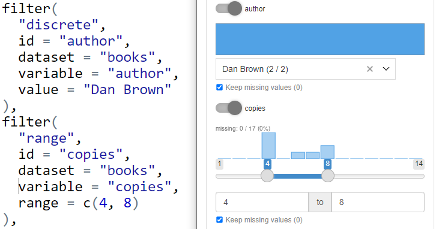

If you skip providing value (or set is to `NA`) the initial selection is calculated automatically:

- for discrete and multi_discrete filter all the options are chosen,
- for range, date_range filters the whole available range is selected,
- for discrete_text filter all the available (comma separated) options are chosen.

2. Inactive filter is collapsed.

Whenever you define filter, the one will be enrolled and ready to use by default:

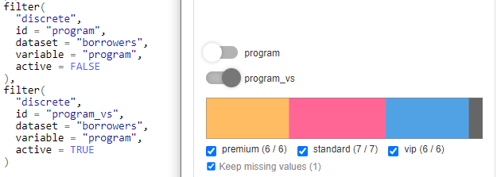

If you want provide the selected filter as the optional one in Shiny, you may set `active = FALSE` in filter configuration.
In GUI, the filter will be collapsed and skipped while computing Cohort data.

From UX (and performance) perspective it's worth to always collapse all the filters initially.

You may achieve this by setting `options("cb_active_filter" = FALSE)` before you create filters.

3. Dropdown or checkbox group for discrete filter

By default, discrete filters are transformed for checkbox group input controller.
When having multiple options to choose, the approach may become inconvenient.

You may switch from checkbox group to search dropdown (`shinyWidgets::virtualSelectInput`) with providing
`gui_input = "vs"` parameter to discrete filter.

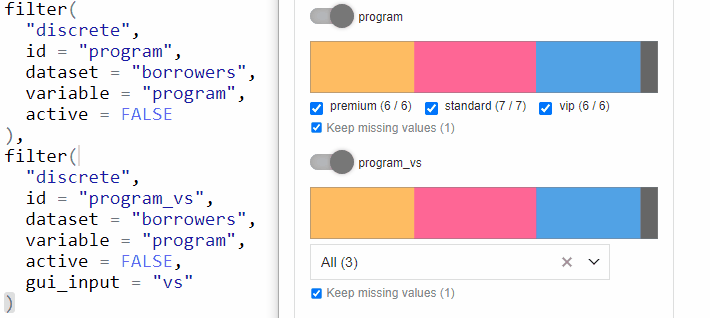

You can customize the input controller with `gui_args` argument (see the next section).  

4. Slider or numeric input for range filter

For range filters the default input in GUI is connection of slider and numeric range input.
You can choose which input to use by providing selected `gui_input` parameter:

- `gui_input = "numeric"` - numeric range only,
- `gui_input = "slider"` - slider only,
- `gui_input = c("slider", "numeric")` or skipped - both options.

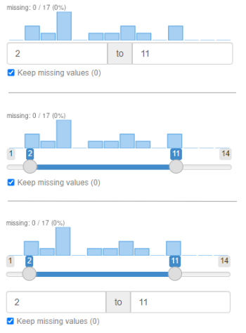

5. Controller configuration

You can customize filter GUI controller with `gui_args` argument passed to the filter.
The argument stores list of parameters that are passed to the function responsible for generating the filter controller.

List of functions that are used for specific filter type:

- `"discrete"` (default) - `shiny::checkboxGroupInput`
- `"discrete"` (`gui_input = "vs"`) - `shinyWidgets::virtualSelectInput`
- `"range"` (`gui_input = "slider"`) - `shiny::sliderInput`
- `"range"` (`gui_input = "numeric"`) - `shinyWidgets::numericRangeInput`
- `"range"` (`gui_input = c("slider", "numeric")`, default) - arguments are passed to both functions
- `"date_range"` - `shiny::dateRangeInput`
- `"multi_discrete"` - `shinyGizmo::pickCheckboxInput`
- `"discrete_text"` - `shinyGizmo::textArea`

An example is disabling search feature and showing dropdown list at the top of it.
You can achieve this with:

```
filter(type = "discrete", ..., gui_input = "vs", gui_args = list(search = FALSE, position = "top"))
```

6. Mapping for discrete filter options

It may happen some of the columns are storing key, not readable values to the users.
In this case we'd like to replace keys with understandable labels in the input controller.

To achieve the goal you need to create the mapping function taking keys vector as an 
argument and cohort and returning labels. 
The function should be then added to Source while its creation using `value_mappings` argument.

Then pass the function name (as a character) to `value_mapping` parameter of the filter.

```{r, eval = FALSE}
library(shiny)
library(cohortBuilder)
library(shinyCohortBuilder)

program_vm <- function(programs, cohort) {
  c(
    "standard" = "Standard", 
    "premium" = "Premium", 
    "vip" = "VIP"
  )[programs]
}

librarian_source <- set_source(
  as.tblist(librarian),
  value_mappings = list(program_vm = program_vm)
)
librarian_cohort <- cohort(
  librarian_source,
  filter(
    "discrete", 
    id = "program", 
    dataset = "borrowers", 
    variable = "program",
    value_mapping = "program_vm",
    gui_input = "vs"
  )
)

gui(librarian_cohort)
```

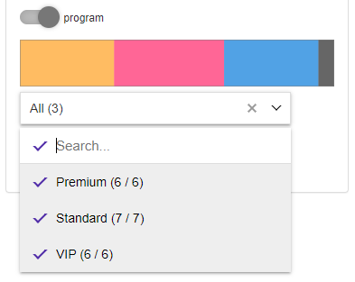

## Automatic filters configuration

If you want to skip configuring filters for all of the tables and columns in the source, you may use `shinyCohortBuilder::autofilter` method.

The method applied on Source, will scan all the columns included in Source and automatically configure proper filters to them.
The filters will be stored within a Source, so it's enough to pass such object to Cohort:

```{r}
iris_source <- set_source(tblist(iris = iris)) %>% 
  autofilter()
iris_cohort <- cohort(iris_source)

sum_up(iris_cohort)
```

The `autofilter` method checks column type and count of levels to apply the proper filter:

- numeric or integer class - range filter,
- factor or character with levels count equal to column length (usually primary keys) - discrete_text filter,
- factor or character with less than 4 levels, or logical column - discrete filter with checkbox group input,
- factor or character with more than 4 levels and more - discrete filter with virtual select input.

Providing custom rules will be added in the future releases of `shinyCohortBuilder`.

**Note.** You can use `autofilter` to attach the generated filters configuration to Source as
`available_filters` attribute. Just use `autofilter(..., attach_as = "meta")`.
See [Multiple-steps filters](#multiple-steps-filtering).

## cohortBuilder to GUI features

Now we're gonna highlight what features available in `cohortBuilder` can be also enabled in GUI panel.

### Multiple-steps filtering

Available with `cb_ui(..., steps = TRUE)`.

The options adds `Add Step` button to filtering panel and attaches `Delete` buttons to each filtering step.
With the functionality you can perform filtering operations in multiple steps.

By default - newly added filtering step is replicated based on the last available step in the Cohort (with choices and statistics related to the previous step).

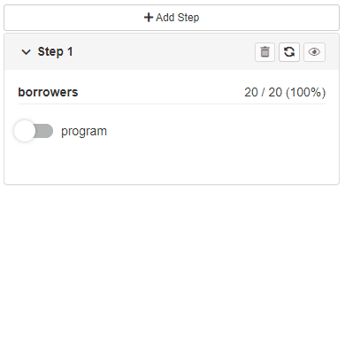

The second option allows users to configure newly added steps.

In order to enable this option:

1. Attach list of available filters as `available_filters` argument while creating source:

```{r, eval = FALSE}
set_source(
  ..., 
  available_filters = list(
    filter("discrete", ...),
    filter("range", ...),
    ...
  )
)
```

2. Specify `cb_ui(..., new_step = "configure")` or `gui(..., new_step = "configure")` to enable configuration panel.

The available filters can be then chosen in step configuration panel. 

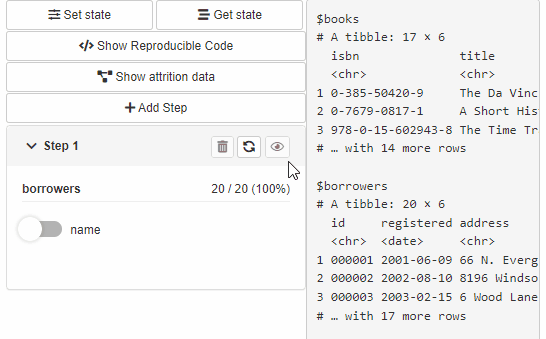

### Reproducible code

Available with `cb_ui(..., code = TRUE)`.

The option adds `Reproducible Code` button to filtering panel.
When the button is clicked a modal shows up presenting reproducible code for source data filtering.

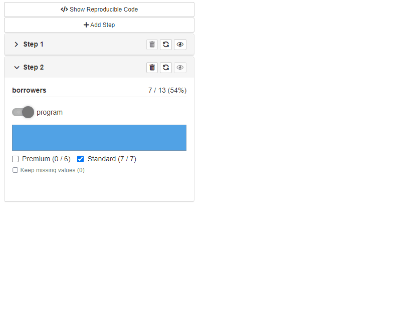

### Saving and restoring Cohort state

Available with `cb_ui(..., state = TRUE)`.

Provides `Get State` and `Save State` buttons to the filtering panel.
Get State opens a modal with Cohort configuration state in JSON format.
Such JSON state can be then used to restore filtering panel state using `Save State` Button.

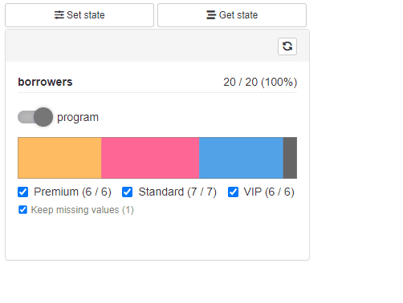

### Display attrition plot

Available with `cb_ui(..., attrition = TRUE)`.

The option adds `Show Attrition` button to the filtering panel.
When clicked, the modal shows data attrition plot across all the filtering steps with a handy summary.
When custom attrition is defined (`.custom_attrition` method) for the used source, the 
modal shows up the custom attrition plot in the modal tabset.

See more at [custom gui layer](custom-gui-layer.html).

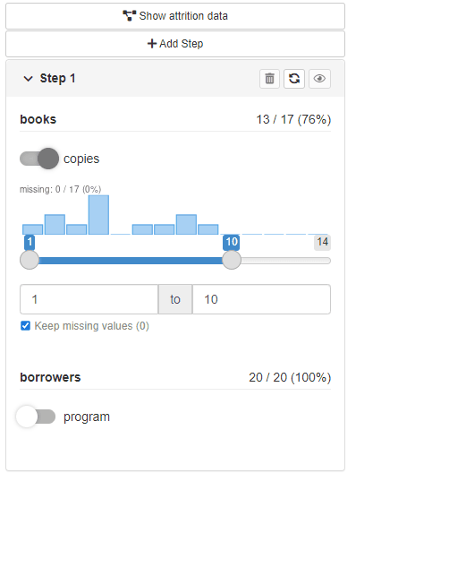

## Extra features

### Run button

Available with `cb_server(..., run_button = "local")` or `cb_server(..., run_button = "global")`.

When the option is enabled a "play" button is displayed at each filtering step panel (or in the top filtering panel in case of `"global"` setting).
More to that, no data operation will be run until the button is clicked.

With `shinyCohortBuilder` each user action (changes in filters selection) triggers data calculation with respect to selected options.
When run button is enabled, the users can specify filters setup first and then run calculations on request.

The option is especially useful when working with large datasets or remote data connections (i.e. using "db" source with cohortBuilder.db).

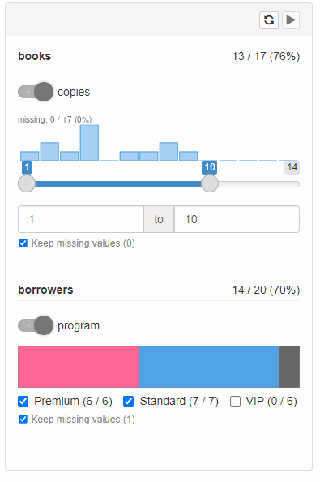

### Bookmarking

Available with `cb_server(..., enable_bookmarking = TRUE)`.

If you use bookmarking in your Shiny application this option may be especially useful.
When turned on, the filtering panel is integrated with native shiny bookmarking so you can use it to restore application state along with all the application inputs (outside the filtering panel).

### Visibility of data statistics

Available with `cb_server(..., stats = c("pre", "post"))`.

Depending on the `stats` parameter you may choose which statistics should be visible in the filtering panel.
There are four options:

1. `stats = c("pre", "post")`

Results with displaying number of table rows (or other statistic implemented in source layer) before and after filtering in step.
More to that shows pre and post filtering statistics for discrete filter choices (counts for each choice).

2. `stats = "pre"`

Same as above but only previous step statistics are shown.

3. `stats = "post"`

Same as above for 1. but only current step statistics are shown (after filtering).

4. `stats = NULL`

No statistics displayed at all.


### Feedback plots

Available with `cb_server(..., feedback = TRUE)`.

When enabled, feedback plots (usually displaying data distribution) are show at each filter.

```{r, include = FALSE}
options(old_opts)
```
